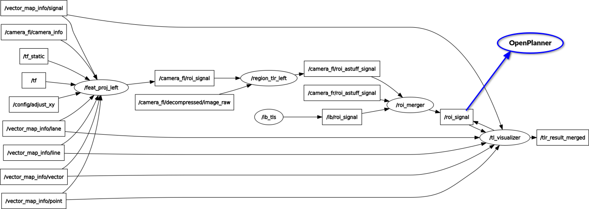
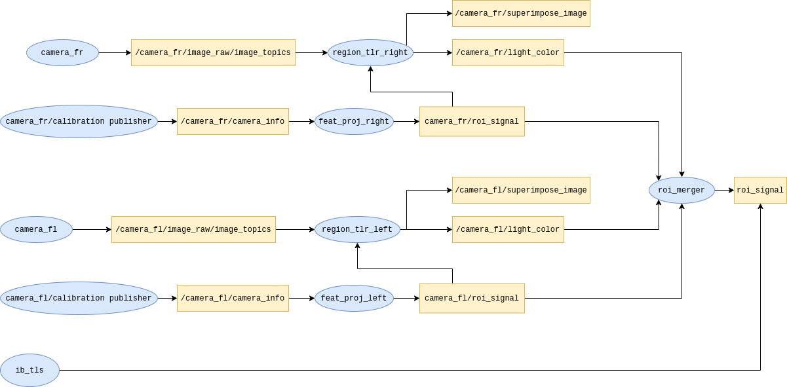

# Trafficlight detection Design

### Traffic Light detection pipeline

For clarity only left camera is used on the image.


##### /feat_proj
* **Description**: Using transforms iterates over all the traffic lights on the vector map and checks if it is seen by the camera. Location of the Signals in camera frame coordinates is published in `/roi_signals`
* **Subscribe**:
  - vector_map - information about traffic lights
  - transforms - transform between camera ... map
  - camera_info - camera extrinsic params
* **Publish**: `/roi_signal` - All the Signals that are seen by the camera and are within distance limits

##### /region_tlr or /tlr_yolo
* **Description**: Extracts ROI image based on information in `roi_signal` for traffic light and classifies it.
* **Subscribe**:
  - `/roi_signal` - signal locations on the image
  - `/image_raw` - raw camera image
* **Publish**:
  - `/roi_astuff_signal` or `/roi_yolo_signal` - all signals classified. Example message for one signal:
  ```
  signalId: 52
  u: 137
  v: 1033
  radius: 25
  x: 9498.05175781
  y: 9659.05175781
  z: 37.0325012207
  hang: 330.0
  type: 0
  linkId: 15
  plId: 5
  ```
    - signalId - id of the signal (Traffic light consists of 3 signals: red, yellow and green)
    - u, v - image coordinates
    - radius - size of the signal on the image
    - x, y, z - map frame coordinates of the signal
    - hang - horizontal angle of the signal
    - type - classification result (Context LightState colors are used: 0 - Green, 1 - Yellow, 2 - Red, 3 - Unknown). More on this can be read in issue #345
    - linkId - originally it was link to lane id, but now refers to stopline id
    - plId - pole id, sometimes used as grouping element for one traffic light
  - Image with classification results:
    - yolo: `/tlr_superimpose_yolo`
    - astuff: `/tlr_superimpose_image`

##### /ib_tls
* **Description**: Either mqtt or http based API access to traffic light information from Traffest.
  - There has to be `tl_stoplines.json` file in the respective vector map folder (/maps/tartu_demo_route/vector_map/tl_stoplines.json) it is used as mapping between traffic light id from API and our stopline id's. Example:
  ```
  {
	"808": [15],
	"809": [17],
  "810": [19],
  "81114": [28, 85],
	"0001": [182, 40]
  }
  ```
* **Publish**
  - `/ib/roi_signal` - the only fields filled there are:
    - `radius: 10000` - big radius is used, so when results are later aggregated with camera based detections API would dominate.
    - `type: 0` - information about traffic light color / current status
    - `linkId: 15` - link to stopline Id

##### /roi_merger
* **Description**: Aggregates camera based and API based traffic light statuses into final `/roi_signal` topic.
  - There can be multiple detected traffic lights from cameras that are for different stoplines (`linkId`). For some of them also the API might have a status (current color).
  - roi_merger sums the `radius`'es over all `linkId`'s and `type`'s
  - `type` with max summed `radius` is selected for each `linkId` as final decision for that stopline (`linkId` is essentially a stopline).
  - stopline status is published
* **Subscribe**:
  - `/roi_astuff_signal` or `/roi_yolo_signal` - from right and left camera
  - `/ib/roi_signal` - api information for the traffic lights
* **Publish**:
  - `/roi_signal` - all the stopline statuses

##### /tl_visualizer
* Visualizes the derived stopline status on the map
* All traffic lights associated to specific stopline are shown with same stopline status color - no individual classification results for traffic lights are used.

##### OpenPlanner
* OpenPlanner checks which stoplines are coming on the path and extracts the stopline Id's
* By matching stopline Id's with the ones from `/roi_signal` it would know the status for the coming stopline with the traffic lights and makes the stopping decision based on that.
  - currently everything that is not green is treated as red!


### Old design

